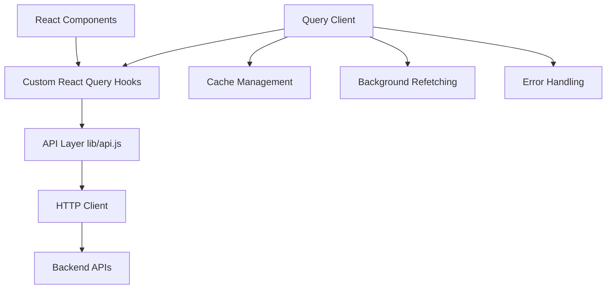

# Design Document

## Overview

This design outlines the migration from raw fetch calls to a centralized API layer using React Query (TanStack Query v5). The migration will establish a unified data fetching strategy that provides automatic caching, background refetching, error handling, and improved developer experience across the entire application.

The design follows a layered approach:
1. **API Layer**: Centralized endpoint definitions and HTTP client configuration
2. **React Query Setup**: Query client configuration with optimized defaults
3. **Custom Hooks**: Abstracted React Query hooks for each API operation
4. **Component Integration**: Systematic replacement of fetch calls with React Query hooks

## Architecture

### High-Level Architecture



### Data Flow

1. **Query Flow**: Component → Custom Hook → API Layer → HTTP Request → Cache Update
2. **Mutation Flow**: Component → Custom Hook → API Layer → HTTP Request → Cache Invalidation → UI Update
3. **Error Flow**: HTTP Error → API Layer → Custom Hook → Component Error State

## Components and Interfaces

### API Layer (`lib/api.js`)

**Purpose**: Centralized API endpoint definitions with consistent error handling and response formatting.

**Key Design Decisions**:
- Single source of truth for all API endpoints
- Standardized error handling across all requests
- Support for authentication token injection
- Request/response interceptors for logging and debugging

**Interface Structure**:
```javascript
// Base API configuration
const apiClient = {
  baseURL: process.env.NEXT_PUBLIC_API_URL,
  timeout: 10000,
  headers: { 'Content-Type': 'application/json' }
}

// Comprehensive API methods supporting all HTTP methods (GET, POST, PUT, DELETE)
const api = {
  posts: {
    getAll: (params) => Promise<PostsResponse>,      // GET
    getById: (id) => Promise<PostResponse>,          // GET
    create: (data) => Promise<PostResponse>,         // POST
    update: (id, data) => Promise<PostResponse>,     // PUT
    delete: (id) => Promise<void>                    // DELETE
  },
  auth: {
    login: (credentials) => Promise<AuthResponse>,   // POST
    logout: () => Promise<void>,                     // POST
    refresh: () => Promise<AuthResponse>             // POST
  },
  users: {
    getProfile: () => Promise<UserResponse>,         // GET
    updateProfile: (data) => Promise<UserResponse>,  // PUT
    deleteAccount: () => Promise<void>               // DELETE
  }
  // Additional domains following the same pattern
}

// Standardized response format for all API calls
const createStandardizedResponse = (data, success = true, message = null) => ({
  data,
  success,
  message,
  errors: success ? [] : [message],
  meta: {
    timestamp: new Date().toISOString()
  }
});
```

### React Query Configuration

**Purpose**: Optimized query client setup with application-specific defaults.

**Key Design Decisions**:
- 5-minute stale time for most queries to balance freshness and performance
- 10-minute cache time to maintain data availability
- Automatic retry with exponential backoff for failed requests
- Background refetching enabled for better UX

**Configuration**:
```javascript
const queryClient = new QueryClient({
  defaultOptions: {
    queries: {
      staleTime: 5 * 60 * 1000, // 5 minutes
      cacheTime: 10 * 60 * 1000, // 10 minutes
      retry: 3,
      retryDelay: attemptIndex => Math.min(1000 * 2 ** attemptIndex, 30000),
      refetchOnWindowFocus: true,
      refetchOnReconnect: true
    },
    mutations: {
      retry: 1,
      onError: (error) => {
        // Global error handling
        console.error('Mutation error:', error);
      }
    }
  }
});
```

### Custom Hooks Layer

**Purpose**: Domain-specific React Query hooks that abstract API calls and provide consistent interfaces.

**Key Design Decisions**:
- One hook per API operation for clear separation of concerns
- Consistent naming convention (useGet*, useCreate*, useUpdate*, useDelete*)
- Built-in loading, error, and success state management
- Automatic cache invalidation for mutations

**Hook Categories**:

1. **Query Hooks** (for data fetching):
   - `useGetPosts()` - Fetch all posts with pagination
   - `useGetPost(id)` - Fetch single post by ID
   - `useGetUserProfile()` - Fetch current user profile

2. **Mutation Hooks** (for data modification):
   - `useCreatePost()` - Create new post with optimistic updates
   - `useUpdatePost()` - Update existing post
   - `useDeletePost()` - Delete post with cache invalidation

**Hook Interface Pattern**:
```javascript
// Query Hook Example
const useGetPosts = (params = {}) => {
  return useQuery({
    queryKey: ['posts', params],
    queryFn: () => api.posts.getAll(params),
    enabled: true
  });
};

// Mutation Hook Example
const useCreatePost = () => {
  const queryClient = useQueryClient();
  
  return useMutation({
    mutationFn: api.posts.create,
    onSuccess: () => {
      queryClient.invalidateQueries(['posts']);
    },
    onError: (error) => {
      // Handle specific error cases
    }
  });
};
```

## Data Models

### Standardized Response Format

All API responses will follow a consistent structure:

```typescript
interface ApiResponse<T> {
  data: T;
  success: boolean;
  message?: string;
  errors?: string[];
  meta?: {
    pagination?: PaginationMeta;
    timestamp: string;
  };
}

interface PaginationMeta {
  page: number;
  limit: number;
  total: number;
  totalPages: number;
}
```

### Query Key Strategy

Consistent query key patterns for effective cache management:

```javascript
// Query Key Patterns
const queryKeys = {
  posts: {
    all: ['posts'],
    lists: () => [...queryKeys.posts.all, 'list'],
    list: (filters) => [...queryKeys.posts.lists(), filters],
    details: () => [...queryKeys.posts.all, 'detail'],
    detail: (id) => [...queryKeys.posts.details(), id]
  },
  users: {
    all: ['users'],
    profile: () => [...queryKeys.users.all, 'profile']
  }
};
```

## Error Handling

### Three-Layer Error Strategy

1. **API Layer Error Handling**:
   - HTTP status code interpretation
   - Network error detection
   - Response validation
   - Standardized error object creation

2. **React Query Error Handling**:
   - Automatic retry logic
   - Error boundary integration
   - Global error state management
   - Query-specific error handling

3. **Component Error Handling**:
   - User-friendly error messages
   - Fallback UI components
   - Error recovery actions
   - Loading state management

### Error Types and Responses

```javascript
// Error Classification
const ErrorTypes = {
  NETWORK_ERROR: 'network_error',
  VALIDATION_ERROR: 'validation_error',
  AUTHENTICATION_ERROR: 'auth_error',
  AUTHORIZATION_ERROR: 'authorization_error',
  SERVER_ERROR: 'server_error'
};

// Error Handler Implementation
const handleApiError = (error) => {
  if (error.response?.status === 401) {
    // Handle authentication errors
    redirectToLogin();
  } else if (error.response?.status >= 500) {
    // Handle server errors
    showErrorNotification('Server error occurred');
  }
  // Additional error handling logic
};
```

## Testing Strategy

### Testing Approach

1. **API Layer Testing**:
   - Mock HTTP requests using MSW (Mock Service Worker)
   - Test error handling scenarios
   - Validate request/response transformations
   - Test authentication token handling

2. **React Query Hook Testing**:
   - Test query and mutation behaviors
   - Verify cache invalidation logic
   - Test loading and error states
   - Test optimistic updates

3. **Component Integration Testing**:
   - Test component behavior with React Query hooks
   - Verify loading state UI
   - Test error state handling
   - Test successful data rendering

### Testing Tools and Setup

```javascript
// Test Setup Example
import { QueryClient, QueryClientProvider } from '@tanstack/react-query';
import { renderHook, waitFor } from '@testing-library/react';

const createTestQueryClient = () => new QueryClient({
  defaultOptions: {
    queries: { retry: false },
    mutations: { retry: false }
  }
});

const wrapper = ({ children }) => (
  <QueryClientProvider client={createTestQueryClient()}>
    {children}
  </QueryClientProvider>
);
```

### Migration Strategy

The migration will follow a phased approach:

1. **Phase 1**: Setup infrastructure (API layer, React Query config, base hooks)
2. **Phase 2**: Migrate core data fetching (posts, user data)
3. **Phase 3**: Migrate authentication and user management
4. **Phase 4**: Migrate remaining API calls and cleanup
5. **Phase 5**: Performance optimization and monitoring

This phased approach ensures minimal disruption to the existing application while providing immediate benefits as each phase is completed.