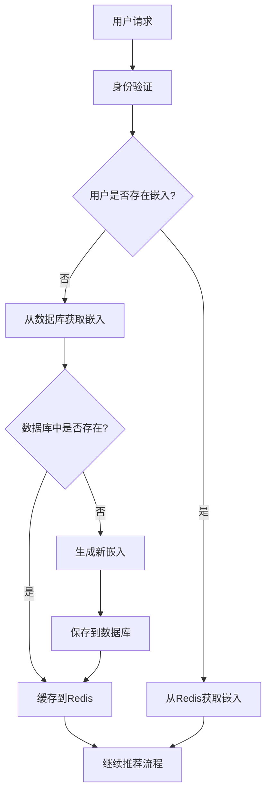
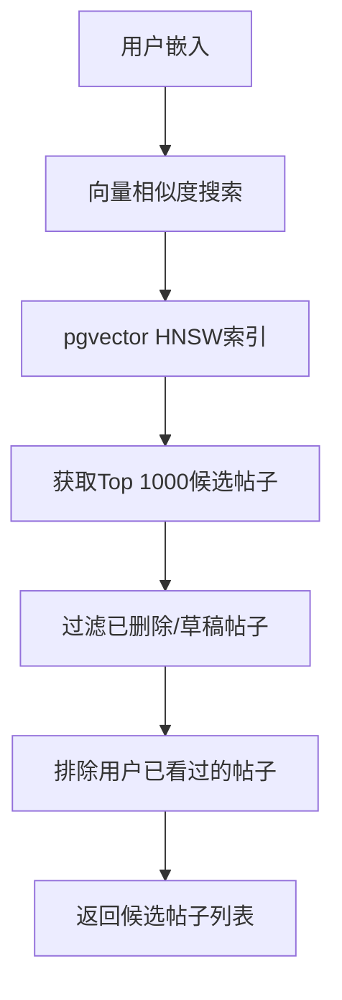
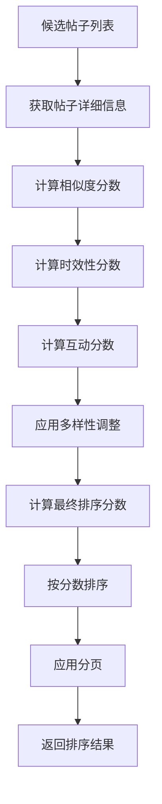
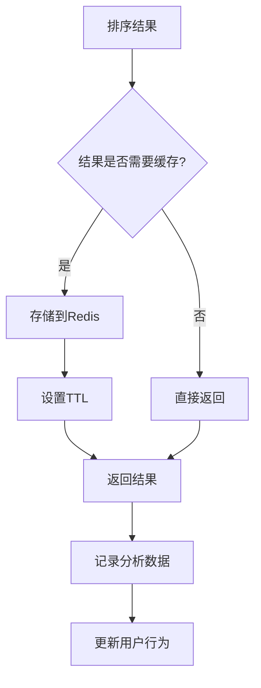

# 推荐系统流程

本文档详细描述了我们推荐系统的完整工作流程，从用户请求到最终内容展示的每个步骤。

## 系统概览

我们的推荐系统采用基于向量嵌入的多阶段架构，确保为每个用户提供个性化且相关的内容推荐。

### 核心组件

1. **用户嵌入生成器** - 基于用户行为创建兴趣向量
2. **帖子嵌入生成器** - 为每个帖子生成内容向量
3. **向量相似度搜索引擎** - 使用pgvector进行高效匹配
4. **多因子排序系统** - 结合相似度、时效性和互动度
5. **缓存层** - Redis多级缓存提升性能

## 详细流程

### 第一阶段：用户身份识别与嵌入获取



#### 1.1 用户嵌入生成

用户嵌入通过以下数据生成：

- **用户交互历史**：点赞、评论、收藏、分享
- **浏览行为**：查看时长、滚动深度
- **内容偏好**：关注的版块、话题订阅
- **时间模式**：活跃时间段、使用频率

```javascript
// 用户嵌入生成示例
const userEmbedding = await generateUserEmbedding({
  interactions: userInteractions,
  viewHistory: userViews,
  preferences: userPreferences,
  timePatterns: userTimePatterns
});
```

#### 1.2 嵌入存储策略

- **PostgreSQL**：持久化存储，使用vector(384)类型
- **Redis**：快速访问缓存，TTL为7天
- **更新频率**：每24小时或重要行为触发时更新

### 第二阶段：召回阶段（Recall Phase）



#### 2.1 向量搜索实现

使用PostgreSQL的pgvector扩展进行高效向量搜索：

```sql
-- 核心搜索函数
CREATE OR REPLACE FUNCTION match_posts_to_user(
  user_embedding vector(384),
  match_limit int DEFAULT 1000,
  exclude_posts uuid[] DEFAULT '{}'::uuid[]
) 
RETURNS TABLE (post_id uuid, similarity float)
AS $$
BEGIN
  RETURN QUERY
  SELECT 
    pe.post_id,
    1 - (pe.embedding <=> user_embedding) AS similarity
  FROM post_embeddings pe
  JOIN posts p ON pe.post_id = p.id
  WHERE p.is_deleted = false
    AND NOT pe.post_id = ANY(exclude_posts)
  ORDER BY pe.embedding <=> user_embedding
  LIMIT match_limit;
END;
$$;
```

#### 2.2 索引优化

```sql
-- HNSW索引配置
CREATE INDEX post_embeddings_vector_idx 
ON post_embeddings 
USING hnsw (embedding vector_cosine_ops)
WITH (m = 16, ef_construction = 64);
```

- **m = 16**：每个节点的最大连接数
- **ef_construction = 64**：构建时的搜索宽度
- **vector_cosine_ops**：使用余弦距离操作符

### 第三阶段：排序阶段（Ranking Phase）



#### 3.1 多因子评分系统

```javascript
function calculateRankingScore(post, userEmbedding, weights) {
  // 1. 相似度分数 (0-1)
  const similarityScore = calculateSimilarity(
    post.embedding, 
    userEmbedding
  );
  
  // 2. 时效性分数 (0-1)
  const daysSinceCreation = (Date.now() - post.created_at) / (1000 * 60 * 60 * 24);
  const recencyScore = Math.exp(-Math.log(2) * daysSinceCreation / 7);
  
  // 3. 互动分数 (0-1)
  const engagementRatio = (post.likes + (post.comments * 3)) / Math.max(post.views, 1);
  const engagementScore = Math.min(1, Math.log(engagementRatio + 1) / Math.log(10));
  
  // 4. 多样性调整
  const diversityFactor = calculateDiversityFactor(post, currentResults);
  
  // 最终分数
  const finalScore = (
    similarityScore * weights.similarity +
    recencyScore * weights.recency +
    engagementScore * weights.engagement
  ) * diversityFactor;
  
  return {
    finalScore,
    factors: {
      similarity: similarityScore,
      recency: recencyScore,
      engagement: engagementScore,
      diversity: diversityFactor
    }
  };
}
```

#### 3.2 个性化调整

基于用户历史行为进一步调整排序：

```javascript
function applyPersonalization(posts, userHistory) {
  return posts.map(post => {
    let personalizedScore = post.rankingScore;
    
    // 提升与用户喜欢内容相似的帖子
    if (userHistory.likedPosts) {
      const avgSimilarityToLiked = calculateAverageSimilarity(
        post.embedding, 
        userHistory.likedPosts.map(p => p.embedding)
      );
      personalizedScore *= (1 + avgSimilarityToLiked * 0.2);
    }
    
    // 降低与用户不喜欢内容相似的帖子
    if (userHistory.dislikedPosts) {
      const avgSimilarityToDisliked = calculateAverageSimilarity(
        post.embedding,
        userHistory.dislikedPosts.map(p => p.embedding)
      );
      personalizedScore *= (1 - avgSimilarityToDisliked * 0.1);
    }
    
    return { ...post, personalizedScore };
  });
}
```

### 第四阶段：缓存与优化



#### 4.1 多级缓存策略

1. **召回结果缓存**：2小时TTL
   - Key: `recall:user:{userId}:limit:{limit}`
   - 存储候选帖子ID和相似度分数

2. **排序结果缓存**：30分钟TTL
   - Key: `ranked:user:{userId}:page:{page}:params:{hash}`
   - 存储完整的排序结果

3. **Feed结果缓存**：20分钟TTL
   - Key: `feed:user:{userId}:page:{page}`
   - 存储最终的Feed内容

#### 4.2 缓存失效策略

```javascript
// 缓存失效触发条件
const invalidateCache = async (userId, reason) => {
  const patterns = [
    `recall:user:${userId}:*`,
    `ranked:user:${userId}:*`,
    `feed:user:${userId}:*`
  ];
  
  for (const pattern of patterns) {
    await redis.del(await redis.keys(pattern));
  }
  
  console.log(`Cache invalidated for user ${userId}, reason: ${reason}`);
};

// 触发场景
// 1. 用户产生新的交互行为
// 2. 用户嵌入更新
// 3. 用户偏好设置改变
// 4. 强制刷新请求
```

### 第五阶段：结果返回与分析

#### 5.1 响应格式标准化

```javascript
const standardResponse = {
  posts: rankedPosts,
  pagination: {
    page: currentPage,
    limit: pageSize,
    total: totalCount,
    hasMore: hasNextPage
  },
  metadata: {
    isPersonalized: true,
    fromCache: cacheHit,
    processingTime: endTime - startTime,
    rankingParams: appliedWeights
  },
  debug: {
    recallCount: candidatePosts.length,
    rankingFactors: averageFactors,
    cacheStatus: cacheInfo
  }
};
```

#### 5.2 性能监控

```javascript
// 关键指标追踪
const trackMetrics = {
  // 响应时间
  responseTime: endTime - startTime,
  
  // 缓存命中率
  cacheHitRate: cacheHits / totalRequests,
  
  // 召回质量
  recallPrecision: relevantPosts / totalRecalled,
  
  // 用户参与度
  engagementRate: userInteractions / postsShown,
  
  // 多样性指标
  diversityScore: calculateDiversityScore(results)
};
```

## 性能优化策略

### 1. 数据库优化

- **索引策略**：为常用查询字段创建复合索引
- **分区表**：按时间分区大表以提升查询性能
- **连接池**：使用连接池管理数据库连接

### 2. 缓存优化

- **预热策略**：为活跃用户预生成推荐结果
- **缓存穿透防护**：使用布隆过滤器防止无效查询
- **缓存雪崩防护**：错开缓存过期时间

### 3. 算法优化

- **批量处理**：批量获取和处理帖子数据
- **异步计算**：将耗时计算移至后台任务
- **增量更新**：只更新变化的嵌入向量

## 监控与告警

### 关键指标

1. **系统性能**
   - API响应时间 < 200ms (P95)
   - 缓存命中率 > 80%
   - 数据库查询时间 < 50ms

2. **推荐质量**
   - 用户点击率 > 5%
   - 平均浏览时长 > 30秒
   - 用户满意度评分 > 4.0

3. **系统稳定性**
   - 错误率 < 0.1%
   - 服务可用性 > 99.9%
   - 资源使用率 < 80%

### 告警配置

```yaml
alerts:
  - name: "推荐API响应时间过长"
    condition: "avg(response_time) > 500ms"
    duration: "5m"
    
  - name: "缓存命中率过低"
    condition: "cache_hit_rate < 70%"
    duration: "10m"
    
  - name: "推荐质量下降"
    condition: "click_through_rate < 3%"
    duration: "30m"
```

这个推荐系统流程确保了高质量、个性化的内容推荐，同时保持了良好的性能和用户体验。
