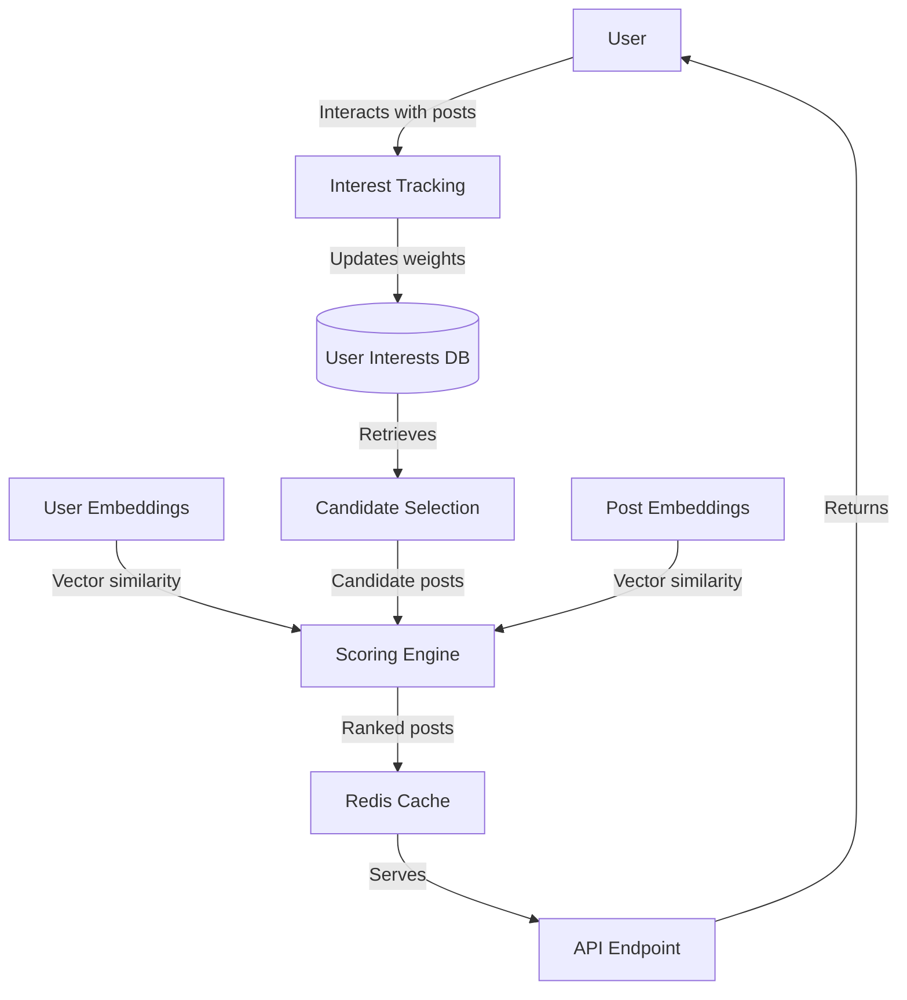

# Post Recommendation System

This document describes the personalized post recommendation system used in EduSocial. The system combines content-based filtering (tag matching) with embedding similarity to provide relevant post recommendations to users.

## Overview

The recommendation system works in three main steps:

1. **Interest Tracking**: Track user interests based on interactions (likes, favorites, views)
2. **Candidate Selection**: Select candidate posts matching user interests
3. **Scoring & Ranking**: Score posts using a weighted combination of interest matching and embedding similarity

## Architecture




## Components

### 1. Interest Tracking System

- Stores user interests in the `user_interests` table
- Each interest has a weight value (0-1)
- Weights are updated based on user interactions
- Time decay is applied to ensure recency bias

### 2. User Embeddings

- Calculated as the average of embeddings from posts the user has liked or favorited
- Cached in Redis as `user:{userId}:embedding`
- Updated when user interacts with new posts

### 3. Scoring System

The final score for each post is calculated as:

```
score = 0.6 * interest_weight + 0.4 * embedding_similarity
```

Where:
- `interest_weight`: Weighted match between user interests and post tags
- `embedding_similarity`: Cosine similarity between user embedding and post embedding

### 4. Caching Strategy

- User feeds are cached in Redis with key `user:{userId}:feed`
- Default TTL is 30 minutes
- Cache is invalidated when user interests change
- Forced refresh option available via API parameter

## API Usage

### Endpoint

```
GET /api/recommend/posts
```

### Query Parameters

- `limit`: Maximum number of posts to return (default: 20)
- `refresh`: Force cache refresh (default: false)

### Example Response

```json
{
  "posts": [
    {
      "id": "uuid-here",
      "title": "Post title",
      "content": "Post content",
      "score": 0.85,
      "interestScore": 0.9,
      "similarityScore": 0.78,
      ...
    },
    ...
  ],
  "cached": false
}
```

## Implementation Details

### SQL Functions

- `get_recommended_posts`: Fetches candidate posts for a user
- `apply_interest_decay`: Applies time decay to interest weights

### JavaScript Utilities

- `calculateCombinedScore`: Combines interest and embedding scores
- `updateInterestWeight`: Updates interest weights based on interactions
- `calculateAverageEmbedding`: Computes user embeddings
- `calculateCosineSimilarity`: Computes similarity between embeddings

## Maintenance and Optimization

### Keeping User Interests Fresh

1. **Time-based decay**: All interest weights are periodically decayed
2. **Recency bias**: Recent interactions have stronger effects on weights
3. **Negative feedback**: "Dislike" actions decrease interest weights

### Performance Considerations

1. **Caching**: Redis caching reduces database load
2. **Batched updates**: Interest updates are performed in batches
3. **Async processing**: Interest updates happen asynchronously

## Future Improvements

1. **Collaborative filtering**: Incorporate recommendations from similar users
2. **Advanced embeddings**: Use finetuned embeddings for better representation
3. **Real-time updates**: Use websockets for immediate feed updates
4. **A/B testing**: Experiment with different scoring weights and algorithms
5. **Diversity enhancement**: Ensure variety in recommended content 